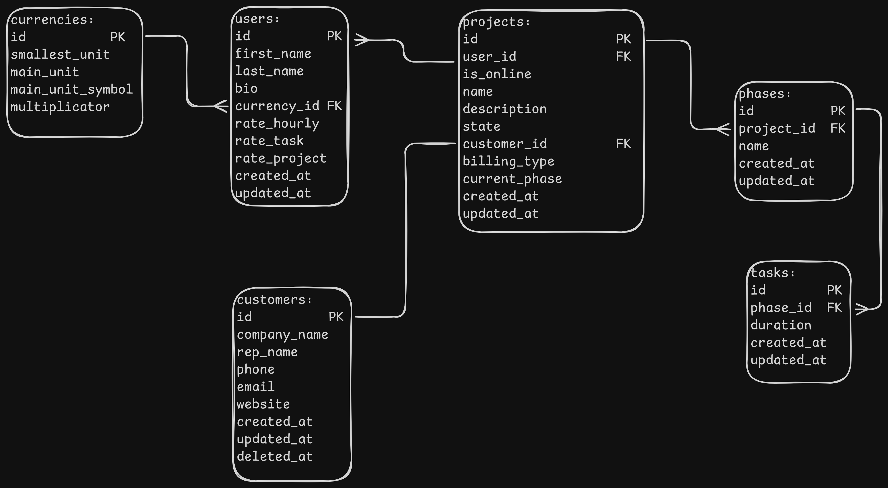

# Data Models

### Persistence Layer via IndexedDB [prototype, React SPA]:

**Responsibilities:**

- Long term data storage

Despite IndexedDB being a NoSQL database, models are shaped in a way that they can be fit into traditional SQL tables. That is because the short term goal of the project is to create a desktop version with SQLite as the persistence layer, and later on a web service with PostgreSQL.

### Models:

```js
User(
    id String           // PK, derived from the users name, current date and a random, 24 bit, hex encoded character sequence
    first_name String
    last_name String
    bio String          // optional field
    currency_id Number  // FK
    rate_hourly Number
    rate_task Number
    rate_project Number
    created_at Date
    updated_at Date
)
```
```js
Currencies(
    id Number                   // PK
    smallest_unit String        // eg. cent for euro
    main_unit String            // eg, euro for euro
    main_unit_symbol String     // eg. EUR
    multiplicator Number        // eg. 100
)
```
```js
Projects(
    id String                   // PK, derived from name, current date and a random, 24 bit, hex encoded character sequence
    user_id String              // FK
    is_online Boolean           // indicates if the project is synced to cloud service
    name String
    description String          // optional field
    state String(enum)          // eg. active, closed
    customer_id String          // FK
    billing_type String(enum)   // eg. project_based, hourly, task_based
    current_phase String        // phase name denormalized
    created_at Date
    updated_at Date
)
```
```js
Phases(
    id Number           // PK
    project_id String   // FK
    name String
    created_at Date
    updated_at Date
)
```
```js
Tasks(
    id Number               // PK
    phase_id Number         // FK
    name String
    description String      // optional field
    duration Number         // elapsed time in seconds
    created_at Date
    updated_at Date
)
```
```js
Customers(
    id String               // PK
    company_name String     // company or individual name
    rep_name String         // optional
    phone String
    email String
    website String          // optional
    created_at Date
    updated_at Date
    deleted_at Date         // soft deletions for auditability
)
```

### Entity Relationship Diagram(crow's foot notation):



